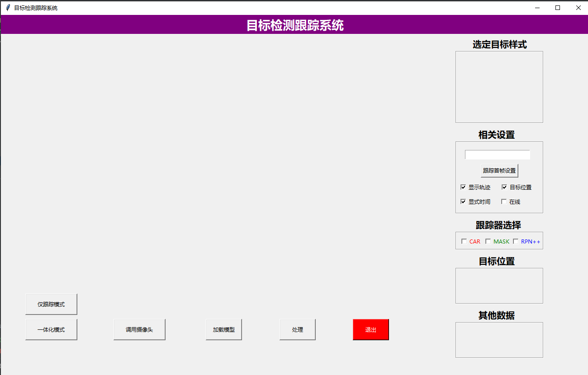
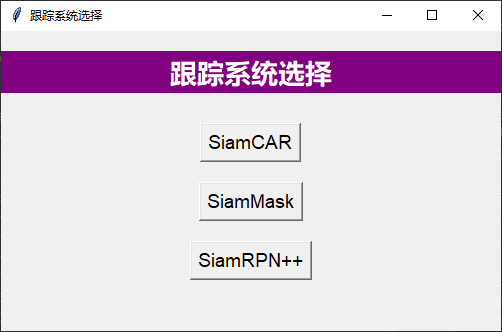
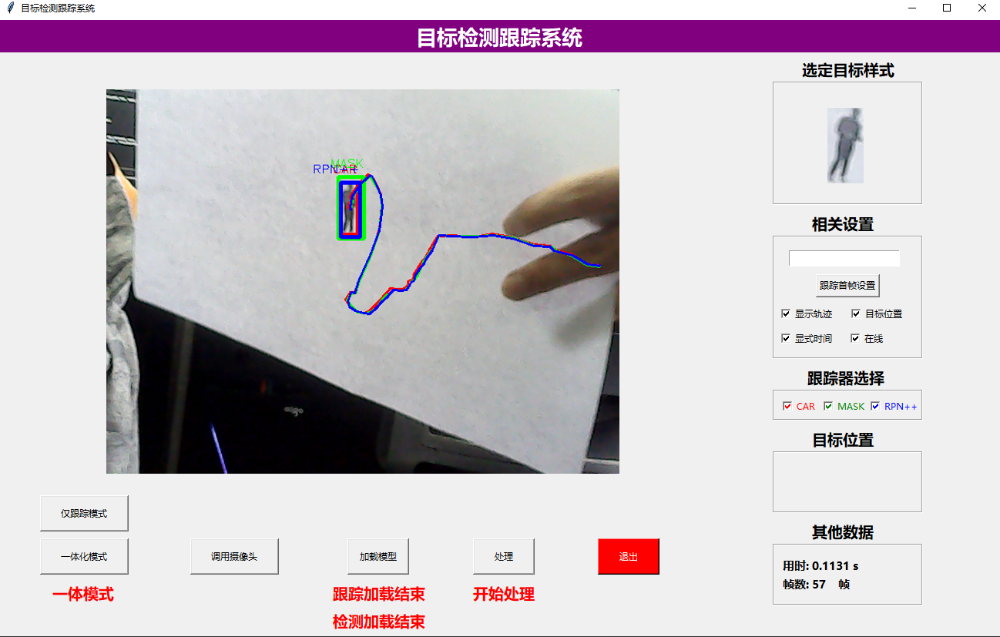

## 目标检测跟踪一体化系统  
【界面代码已开源，剩余代码后期开源（主要为siamcar、siamrpn++、siammask、YOLOv5工程代码）】  

### 1. 系统介绍
该系统整合了YOLOv5检测模型和Siamese相关的跟踪模型（SiamCAR, SiamMask, SiamRPN++）。 
该系统旨在实现目标检测与目标跟踪的协同工作，以提高离线视频以及在线视频跟踪检测的效果。

### 2. 功能概述

- 实现检测模型YOLOv5用于目标检测。
- 集成SiamCAR、SiamMask和SiamRPN++模型，用于目标跟踪。
- 实现检测与跟踪的整合，使其能够协同工作并提供更精确的目标追踪结果。  

### 3. 模式介绍
模式主要分为三种，分别是“仅跟踪”，“检测跟踪一体化”，“在线跟踪”
- **仅跟踪模式**：该模式本为手动目标跟踪模式，该模式不依赖目标检测模型。在系统运行的初始帧中，用户可以通过手动框选目标的位置，系统将以此位置作为目标的初始跟踪位置。接着，系统集成了SiamCAR、SiamMask和SiamRPN++等Siamese相关的跟踪模型，利用这些模型对目标进行实时跟踪。这种模式允许用户手动选择感兴趣的目标，并启动系统以实现目标的持续、准确的跟踪。这种手动目标跟踪模式在无需依赖自动检测的情况下，为用户提供了更多的灵活性和精准性。

- **检测各种一体化模式**：实现了一种检测跟踪一体化模式，其中视频首先经过检测模型进行目标检测。在达到指定帧时，系统提供了用户交互界面，允许用户手动选择目标对象。用户通过点击目标位置，系统以该位置为初始跟踪点，随后启动跟踪模型对目标进行实时跟踪。这种一体化模式将目标检测和手动选择的目标跟踪有效地结合起来，既提高了目标检测的效率，又赋予了用户直观且精准的目标跟踪控制。

- **在线一体化模式**：实现了一种在线一体化模式，视频流首先经过检测模型进行目标检测。当检测模型连续监测到目标存在的帧数达到预设的阈值时，系统自动选择该目标，并启动跟踪模型进行实时跟踪。这种智能一体化模式通过自动检测目标的存在并触发跟踪，实现了自动化的目标选取和跟踪过程，为用户提供了便捷、高效的使用体验。

### 4. 模型介绍
- **YOLOv5**: YOLO (You Only Look Once) 是一种实时目标检测算法，YOLOv5是其最新版本，能够快速高效地检测图像中的多个目标。
  - YOLOv5 GitHub仓库: (https://github.com/ultralytics/yolov5)
  - ``YOLOv5 论文: (https://arxiv.org/abs/2104.02191)

- **SiamCAR**: SiamCAR（Siamese Convolutional Appearance and Regression）是一种基于Siamese网络架构的领先目标跟踪算法。该算法通过构建孪生神经网络，使两个分支共享相同权重，其中一个分支负责处理目标图像，另一个分支负责处理搜索图像。通过相似度计算和回归模型，SiamCAR能够高效而准确地预测目标位置。首先，网络进行初始化，从目标图像和搜索图像中提取深度特征。接着，利用这些特征计算目标特征与搜索特征之间的相似度，常用余弦相似度。最后，通过回归模型进行位置预测，从而确定目标的新位置。SiamCAR突出了高效性，它避免了对整个图像进行检测和分割，从而提高了运行效率。同时，通过深度特征的相似度计算，SiamCAR可以获取目标的高级语义特征，从而提高了跟踪的准确性和鲁棒性。这种算法在复杂视觉场景和快速运动目标中表现出色，具有广泛的适用性。
  - siamcar仓库：(https://github.com/ohhhyeahhh/SiamCAR)
- **SiamMask**: SiamMask是一种领先的目标跟踪和分割算法，结合了目标跟踪和实时目标分割的功能。该算法通过Siamese网络架构，使用目标跟踪模块初始化目标位置，并通过分割模块实时生成目标的精确分割掩模。SiamMask的独特之处在于，它不仅能够实现目标跟踪，还能在目标跟踪的基础上实时生成目标的准确分割，充分展示了目标的精细轮廓和边界信息。这使得SiamMask在视频目标分析、交互式物体分割等领域具有广泛的应用前景。
  - siamMask仓库：(https://github.com/foolwood/SiamMask)[pysot]
- **SiamRPN++**: SiamRPN++（Siamese Region Proposal Network++）是一种高效而精确的目标跟踪算法，采用Siamese架构以及改进的区域提议网络（RPN++）。该算法通过利用孪生网络学习目标特征，以及引入了多尺度特征的RPN模块，实现了目标的准确跟踪。SiamRPN++能够在目标池化和多尺度特征融合的基础上，快速生成候选框并通过回归模型精细调整目标位置。这使得SiamRPN++在速度和准确度上取得了很好的平衡，适用于多种复杂场景下的实时目标跟踪，如视频监视、智能驾驶等应用。
  - siamrpn++仓库：(https://github.com/PengBoXiangShang/SiamRPN_plus_plus_PyTorch)[pysot]

### 5. 使用方式

- **环境设置**:
   - 确保已配置正确的Python环境，并安装所需依赖（参考requirements），包括YOLOv5、SiamCAR、SiamMask和SiamRPN++等模型所需的依赖。

- **模型下载**:
   - 下载YOLOv5模型并按照其文档进行配置和训练。
   - 下载SiamCAR、SiamMask和SiamRPN++模型并按照各自的文档进行配置和使用。

- **系统运行**:
  - 运行yolo+siamcar:`python vision_siamcar.py`  
  - 运行yolo+siammask:`python vision_siammask.py`  
  - 运行yolo+siamrpn++:`python vision_siamrpn++.py`  
  - 运行可选择跟踪模型：`python vision_open.py`
  - 自由选择跟踪模型：`python vison_track_all.py`

### 6.页面展示 
- 自由选择界面 
  
- 可选择界面  
  
- 跟踪演示  
  
### 其它

- 跟踪模型的输入图片是变色的，不管是在track还是在init过程中，两者的输入图如果不是变色的（[:,:,::-1]）则会导致跟踪效果大幅下降
- 是否变色可用Image.show()查看，在黑白图片跟踪的时候，不变色图片也会产生跟踪效果不错的假象。
- 在界面上点击事件和绘矩形框事件产生的相对位置要相对于变形后的图片，而不是图片后的窗口（跟踪检测一体化这个问题产生的误差可以接受（裁剪图以检测为准，点击事件只需在检测框内就行），仅跟踪产生的误差不可接受）

- 系统题目：目标检测跟踪一体化系统  
- 作者：ChenHu  
- Copyright： Free  (请勿用于任何盈利性质的活动)
- 更新时间： 20230922  
